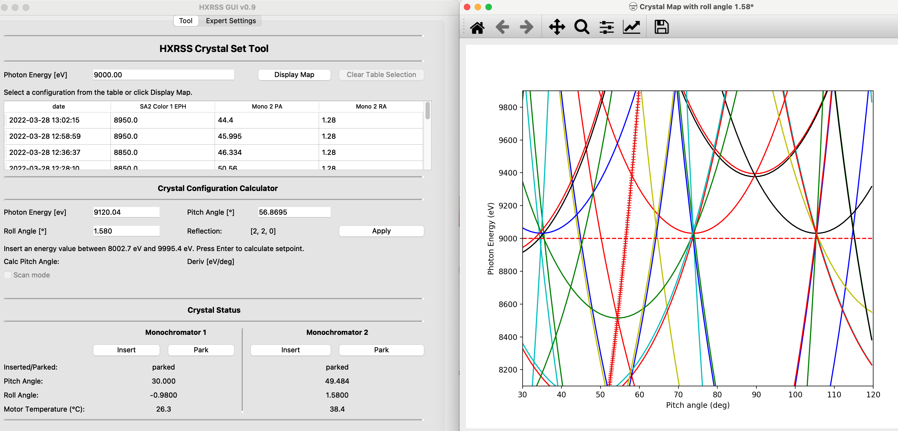

# Hard X-Ray Self-Seeding (HXRSS) Crystal Control at the European XFEL
Contributors: Gianluca Geloni, Christian Grech, Marc Guetg, Christoph Lechner 

### Crystal Set Tool
The Crystal Set tool is a PyQt GUI designed to be used by machine operators to control the position of monochromator crystals used in Hard X-Ray Self-Seeding free electron lasers. Through the use of a calibrated Bragg's model, the relationship between the rotational position of a crystal and the reflection energy is known accurately (see [1]). This allows the calculation of the position of the crystal by providing the desired reflection energy. The tool calculates the crystal rotational configuration and executes the movement.

A scan feature is available where a reflection is picked and as the undulator photon energy changes, the crystal pitch angle moves synchronously. The motor temperature is also tracked and scanning is stopped when exceeding a predefined value.

[1]   C. Grech, G. Geloni, and M.W. Guetg, “Machine Learning Applied for the Calibration of the Hard X-Ray Single-Shot Spectrometer at the European XFEL”, in Proc. IPAC'22, Bangkok, Thailand, Jun. 2022, pp. 965-968. doi:10.18429/JACoW-IPAC2022-TUPOST046

